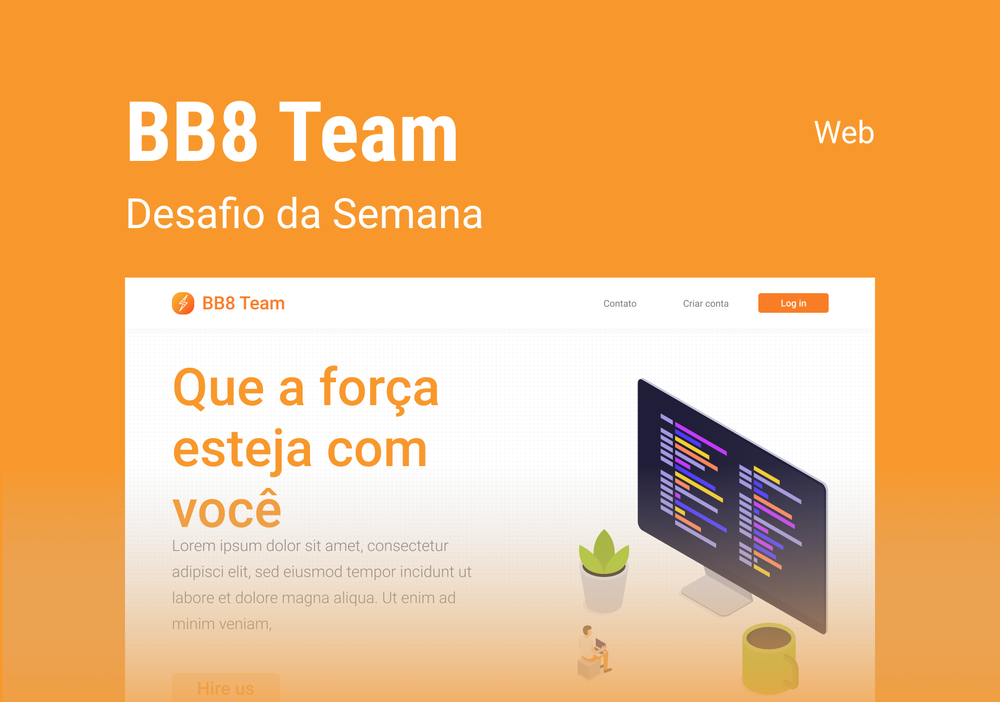

# Desafios ✨

Oiee Pessoal!

Bem vindos aos desafios da **Tech da Semana - Bootstrap**! Nesta semana temos um layout maravilhoso com 3 Desafios para vocês.

Então chega de bate papo e boooooraaaaaaa codar </> 💻

---
### O que é:
Com ele, você deverá desenvolver a parte front-end do site de uma agência de tecnologia, utilizando Bootstrap. São 3 níveis de desafios para você aprender e praticar seus conhecimentos!

#### 1️⃣ Desafio - Desenvolver as páginas de Login e Cadastro da plataforma (=\^-\^=)
#### 2️⃣ Desafio - Desenvolver tudo acima mais a página principal e o modo escuro (=\^-\^=)
#### 3️⃣ Desafio - Desenvolver tudo descrito acima mais as páginas mobile, para deixar responsivo (=\^-\^=)

### Material
Você deverá utilizar o nosso [Design no Figma](https://www.figma.com/file/87P2bmC0xNGOaRWqvMFeR3/BB8-Team-UI-Copy/duplicate) para desenvolver as páginas. O design foi feito pelo no querido [Ruy](https://github.com/ruymon):

Qualquer dúvida veja a documentação do [Bootstrap](https://getbootstrap.com/)!

  

---

- [ ] Envie no nosso [Discord](https://discord.gg/pDbY76q8Qf) no canal 🥇丨finalizados  seu repositório no GitHub com o resultado do Desafio.

`OBS: Lembramos que esses Desafios são para estudo próprio sem nenhum tipo de revisão ou pontuação. Contudo, alguns projetos serão divulgados no Instagram da Rafa`

©️ **Comunidade Ballerini**