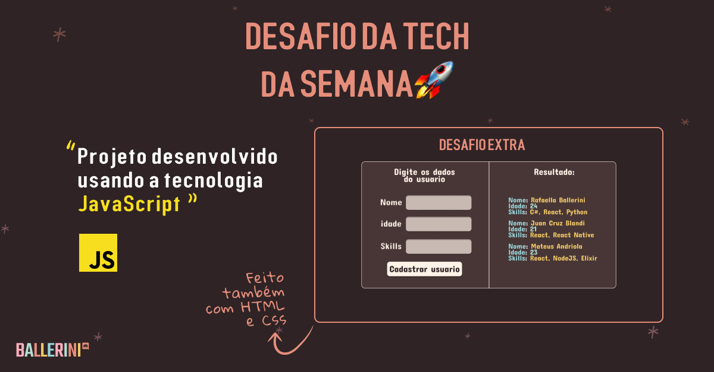

# Desafios ✨

Oiee Pessoal!

Bem vindos aos desafios da **Tech da Semana - JavaScript**! Nesta semana temos alguns desafios simples com um desafio extra no final.

Então chega de bate papo e boooooraaaaaaa codar </> 💻

---
### O que é:
Explicar que também haverá um desafio extra ou algo do tipo aqui.

#### 1️⃣ Desafio - Objetos e leitura de Resposta (=\^-\^=)
Desenvolva um programa que recebe valores e consiga exibir as respostas logo em seguida.  Ex: Qual o seu nome? Quantos anos você tem? Qual linguagem de programação você está estudando?   "Olá X, você tem X anos e já está aprendendo X!"
#### 2️⃣ Desafio -  Loops (=\^-\^=)
Desenvolva um programa que receba um valor de troco e depois com um loop consiga nos dizer qual a quantidade mínima de moedas a serem recebidas.   Ex: Quanto foi seu troco? Valor: X   "A quantidade mínima de moedas a ser recebida como troco são X, sendo X de 1 real, X de 50 centavos e 1 X de 5 centavos." 
#### 3️⃣ Desafio - Leitura e conta (=\^-\^=)
Desenvolva um programa que recebe uma ou mais frases e consiga calcular o número de letras, palavras e frases.  Ex: Frase: Lorem ipsum dolor sit amet, consetetur sadipscing elitr.   "Este parágrafo tem X letras, X palavras e X frases."

### Material
Você deverá utilizar o nosso [Design no Figma](https://www.figma.com/file/nPRQtJqmENcS9eO46IwJo8/DesafioJS---Comunidade-Ballerini?node-id=0%3A1) para desenvolver a(s) página(s).

Material de apoio:
* [Prompt e Alert](https://www.devmedia.com.br/alert-em-javascript/37208);
* [Objects](https://developer.mozilla.org/pt-BR/docs/Web/JavaScript/Guide/Working_with_Objects#objetos_tudo);
* [If/Else](https://developer.mozilla.org/pt-BR/docs/Web/JavaScript/Reference/Statements/if...else);
* [Operators](https://developer.mozilla.org/pt-BR/docs/Web/JavaScript/Reference/Operators#operadores_de_igualdade);
* [While](https://developer.mozilla.org/pt-BR/docs/Web/JavaScript/Reference/Statements/while);
* [For](https://developer.mozilla.org/pt-BR/docs/Web/JavaScript/Reference/Statements/for);

#### Desafio Extra - HTML, CSS
Replique o design proposto abaixo e faça a página ficar funcional. Leitura de inputs, exibição.

  

---

- [ ] Envie no nosso [Discord](https://discord.gg/ballerini) no canal 🥇丨finalizados seu repositório no GitHub com o resultado do Desafio.

`OBS: Lembramos que esses Desafios são para estudo próprio e desenvolver as habilidades dos membros nessa tecnologia. Contudo, haverá um TOP 10 melhores projetos + um ganhador que vai ser anunciado no LinkedIn da Comunidade.` [Link](https://www.linkedin.com/company/comunidadeballerini) 

©️ **Comunidade Ballerini**