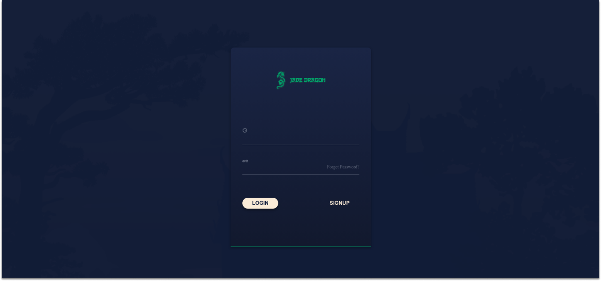

# Desafios ✨

Oiee Pessoal!

Bem vindos aos desafios da **Tech da Semana - Node.js**! Nesta semana temos três desafios, um envolvendo um pouco de lógica e outros voltados para o back-end.

Então chega de bate papo e boooooraaaaaaa codar </> 💻

---
### O que é:
No desafio dessa tech estamos com 3 desafios, sendo separadas entre: fácil, intermediário e difícil. Sendo o último acompanhado de um layout já pré-pronto para os membros terem que se preocupar apenas com o Back-end.

#### 1️⃣ Desafio - Gerador de Senhas (=\^-\^=)
Desenvolva um gerador de senhas que em vez de usar letras, caracteres ou números. Utiliza emojis 🖖

#### 2️⃣ Desafio - API Rest (=\^-\^=)
Desenvolva uma API Rest que: busque, crie, atualize e delete, uma lista de usuários. Além disso, a API deve servir múltiplos clientes (mobile, browser etc.).

#### 3️⃣ Desafio - Autenticação (=\^-\^=)
Crie um sistema de autenticação de usuário: pode usar o JWT ou o Passport.js. Utilize o layout de login disponível para criar o sistema.

### Material

Material de apoio:
* [Criar o projeto](https://docs.npmjs.com/cli/v7/commands/npm-init);
* [Método Map](https://developer.mozilla.org/pt-BR/docs/Web/JavaScript/Reference/Global_Objects/Array/map);
* [O que é API Rest](https://www.redhat.com/pt-br/topics/api/what-is-a-rest-api);
* [Introdução a API Rest](https://developer.mozilla.org/pt-BR/docs/Learn/JavaScript/Client-side_web_APIs/Introduction);
* [Framework Express](https://expressjs.com/pt-br/starter/installing.html);
* [JWT](https://jwt.io/);
* [Passport](https://www.passportjs.org/);
* [Públique seu projeto na Heroku](https://www.luiztools.com.br/post/como-publicar-aplicacao-node-js-na-heroku/);

[Layout do desafio ->](https://github.com/Ballerini-Server/node-authentication-challenge)

  

---

- [ ] Envie no nosso [Discord](https://discord.gg/ballerini) no canal 🥇丨finalizados seu repositório no GitHub com o resultado do Desafio.

`OBS: Lembramos que esses Desafios são para estudo próprio e desenvolver as habilidades dos membros nessa tecnologia. Contudo, haverá um TOP 10 melhores projetos + um ganhador que vai ser anunciado no LinkedIn da Comunidade.` [Link](https://www.linkedin.com/company/comunidadeballerini) 

©️ **Comunidade Ballerini**