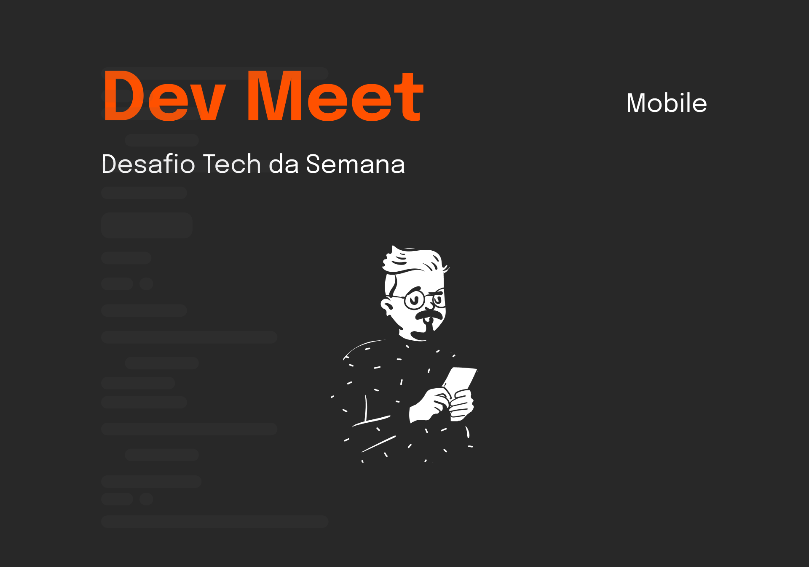

# Desafios ✨

Oiee Pessoal!

Bem vindos aos desafios da **Tech da Semana - React Native**! Nesta semana temos um desafio muito massa envolvendo React Native que é um projeto que adoramos criar, e acho que vocês também vão curtir.

Então chega de bate papo e boooooraaaaaaa codar </> 💻

---
### O que é:
O projeto está sendo comentado melhor no Figma, porém, aqui vai algumas informações que podem ser úteis para vocês.

#### 1️⃣ Desafio - Login (=\^-\^=)
Desenvolva três telas: Tela de loading (splash screen), tela inicial e tela de eventos.

#### 2️⃣ Desafio - Informações do Evento (=\^-\^=)
Desenvolva uma quarta tela que mostre mais informações sobre o evento. Além de resumir as infos da terceira tela.

#### 3️⃣ Desafio - App completo (=\^-\^=)
Agora desenvolva uma aplicação completa. Dessa vez com uma adição de uma tela que o usuário pode escolher a categoria do evento que ele deseja. Além de consumir uma API JSON.

### Material
Você deverá utilizar o nosso [Design no Figma](https://www.figma.com/file/UgZj1C1DWJlVftvMLz1Aq9/Dev-Meet?node-id=0%3A1) para desenvolver a(s) página(s).
Fake API para consumir. [Clique aqui!](https://github.com/Ballerini-Server/dev-meet-backend)

Material de apoio:
* [Criar o projeto](https://reactnative.dev/docs/environment-setup);
* [Como fazer animação em react native](https://blog.pusher.com/animation-react-native-part-1/);
* [Feather Icons](https://feathericons.com/) - Está sendo usado apenas dois ícones com essa lib;
* [Quem quiser saber como hospedar um projeto react native](https://apiko.com/blog/deploying-react-native-apps-to-app-store-and-play-market/);
* [Quem quiser fazer RN com TypeScript](https://ildaneta.dev/posts/criando-um-projeto-react-native-do-zero-com-typescript-adicionando-fontes-externas/);

  

---

- [ ] Envie no nosso [Discord](https://discord.gg/ballerini) no canal 🥇丨finalizados seu repositório no GitHub com o resultado do Desafio.

`OBS: Lembramos que esses Desafios são para estudo próprio e desenvolver as habilidades dos membros nessa tecnologia. Contudo, haverá um TOP 10 melhores projetos + um ganhador que vai ser anunciado no LinkedIn da Comunidade.` [Link](https://www.linkedin.com/company/comunidadeballerini) 

©️ **Comunidade Ballerini**