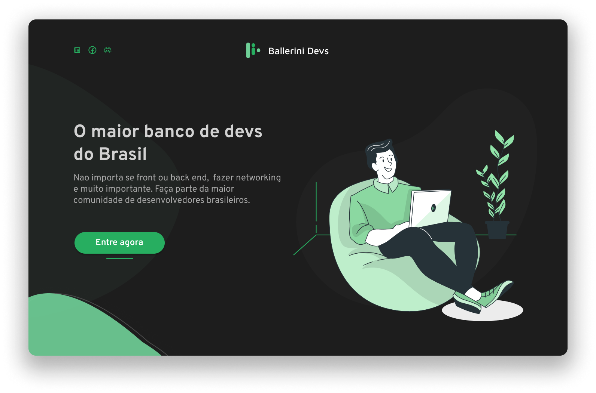

# Desafios ✨

Oiee Pessoal!

Bem vindos aos desafios da **Tech da Semana - React.js**! Nesta semana temos um projeto de landing page que vai ser voltado para um banco de dados de devs.

Então chega de bate papo e boooooraaaaaaa codar </> 💻

---
### O que é:
O desafio consiste em criar uma landing page que foi dividida em três etapas, cada uma especificada logo abaixo.

#### 1️⃣ Desafio - Landing Page (=\^-\^=)
Recriar a landing page do Ballerini Devs de acordo com o projeto no Figma, com botão de entrada e background.

#### 2️⃣ Desafio - Tabela de Devs (=\^-\^=)
Adicionar as telas de lista de Devs, com função para adicionar devs.

#### 3️⃣ Desafio - Tabela de Devs Avançada (=\^-\^=)
Adicionar as funções de editar, deletar e pesquisar por devs

### Material
Você deverá utilizar o nosso [Design no Figma](https://www.figma.com/file/FX14O2BvLp8UEbXrSkdcUc/Ballerini-Devs?node-id=1763%3A20) para desenvolver a(s) página(s).

Material de apoio:
* [Criar o projeto](https://create-react-app.dev/);
* [Alternativa de criar com Vite](https://vitejs.dev/guide/) - Recomendado;
* [Como usar o JSX](https://pt-br.reactjs.org/docs/introducing-jsx.html);
* [Componentes e Props](https://pt-br.reactjs.org/docs/components-and-props.html);
* [Listas e chaves](https://pt-br.reactjs.org/docs/lists-and-keys.html);
* [Formulários](https://pt-br.reactjs.org/docs/forms.html);
* [Hooks do React](https://pt-br.reactjs.org/docs/hooks-intro.html);

  

---

- [ ] Envie no nosso [Discord](https://discord.gg/ballerini) no canal 🥇丨finalizados seu repositório no GitHub com o resultado do Desafio.

`OBS: Lembramos que esses Desafios são para estudo próprio e desenvolver as habilidades dos membros nessa tecnologia. Contudo, haverá um TOP 10 melhores projetos + um ganhador que vai ser anunciado no LinkedIn da Comunidade.` [Link](https://www.linkedin.com/company/comunidadeballerini) 

©️ **Comunidade Ballerini**