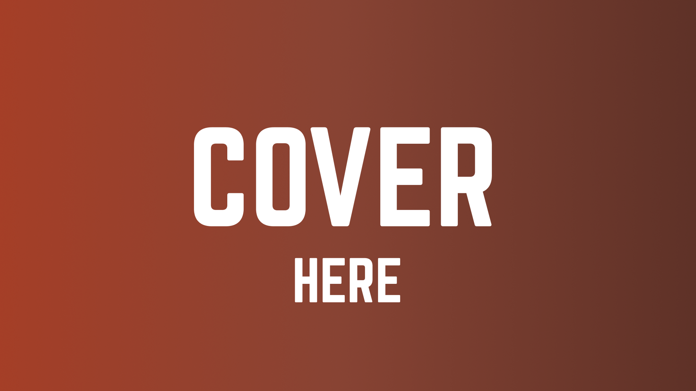

# Desafios ✨

Oiee Pessoal!

Bem vindos aos desafios da **Tech da Semana - \<tech name\>**! Nesta semana temos um \<explicar o que vai ter de desafio/projeto essa semana\>.

Então chega de bate papo e boooooraaaaaaa codar </> 💻

---
### O que é:
Explicar que também haverá um desafio extra ou algo do tipo aqui.

#### 1️⃣ Desafio - Texto do Desafio 1 (=\^-\^=)
#### 2️⃣ Desafio - Texto do Desafio 2 (=\^-\^=)
#### 3️⃣ Desafio - Texto do Desafio 3 (=\^-\^=)

### Material
Você deverá utilizar o nosso [Design no Figma](https://figma.com/) para desenvolver a(s) página(s).

Material de apoio:
[Link 1](https://example.com);
[Link 2](https://example.com);
[Link 3](https://example.com);
...

  

---

- [ ] Envie no nosso [Discord](https://discord.gg/ballerini) no canal 🥇丨finalizados seu repositório no GitHub com o resultado do Desafio.

`OBS: Lembramos que esses Desafios são para estudo próprio e desenvolver as habilidades dos membros nessa tecnologia. Contudo, haverá um TOP 10 melhores projetos + um ganhador que vai ser anunciado no LinkedIn da Comunidade.` [Link](https://www.linkedin.com/company/comunidadeballerini) 

©️ **Comunidade Ballerini**